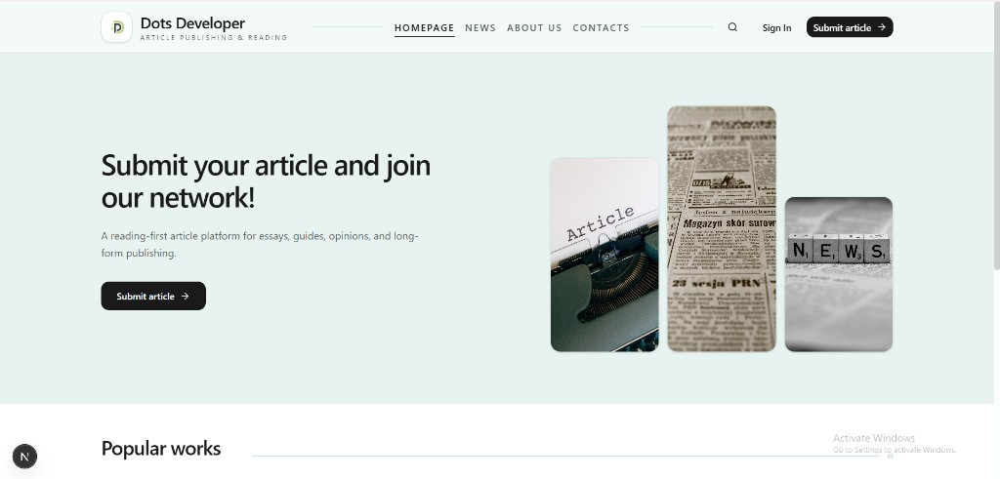
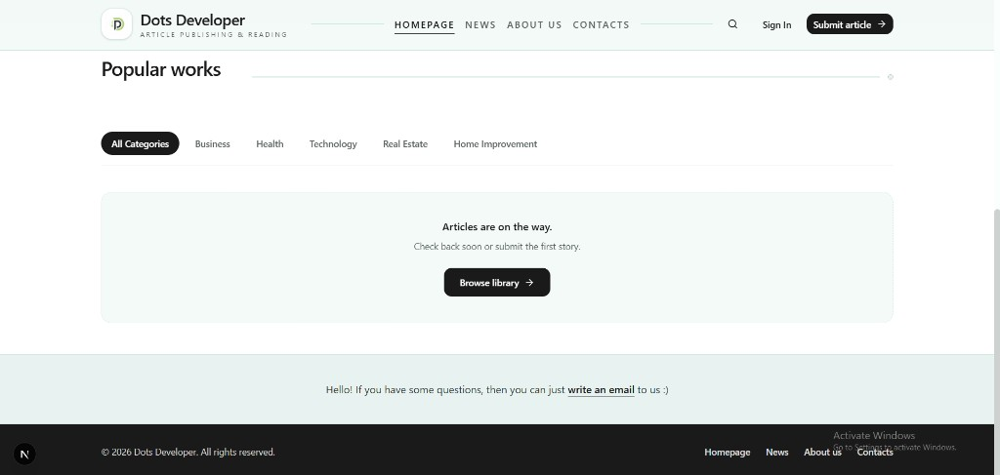
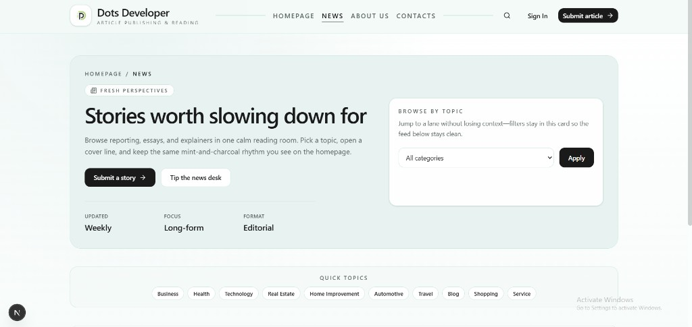
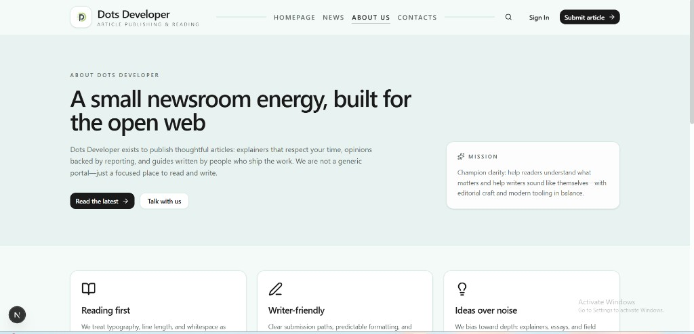
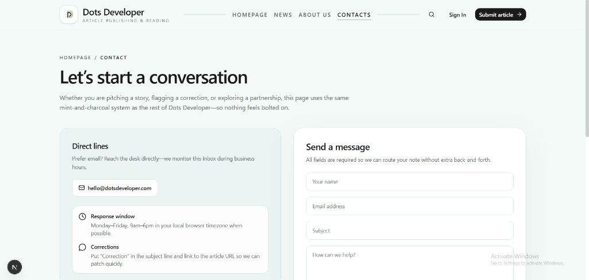
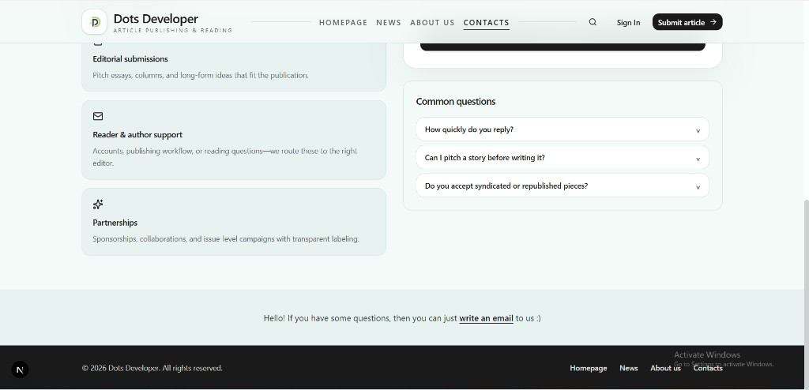

# Dots Developer

Article publishing and reading platform built with [Next.js](https://nextjs.org/). Mint-and-charcoal editorial UI: homepage hero, news desk, about, and contact flows share one visual system.

## UI screenshots

Images are stored in-repo under [`docs/readme-screenshots/`](./docs/readme-screenshots/) so they render on GitHub without external hosting.

### Homepage — hero



### Homepage — popular works & footer



### News (articles)



### About



### Contact — direct lines & form



### Contact — topics & FAQ



## Development

```bash
pnpm install
pnpm dev
```

Open [http://localhost:3000](http://localhost:3000).

## Build

```bash
pnpm build
pnpm start
```
